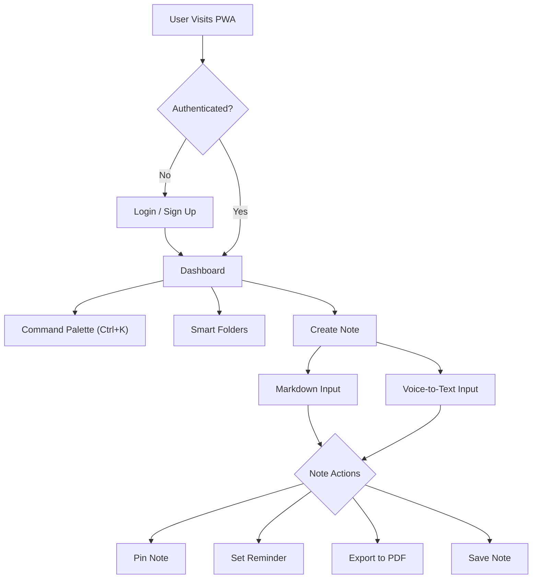
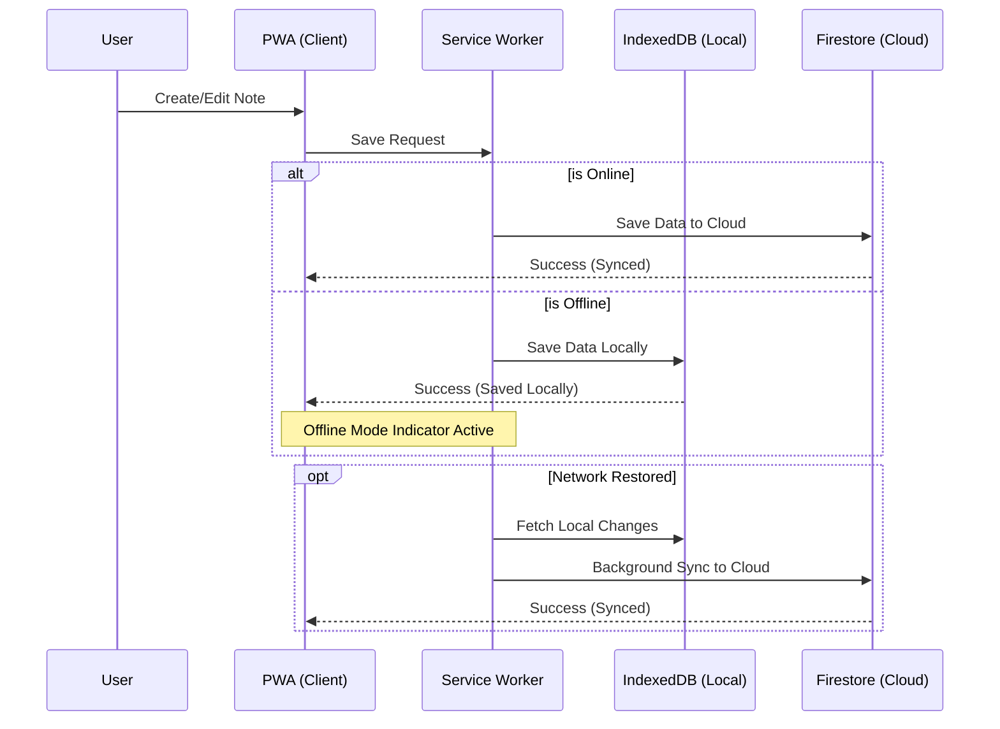
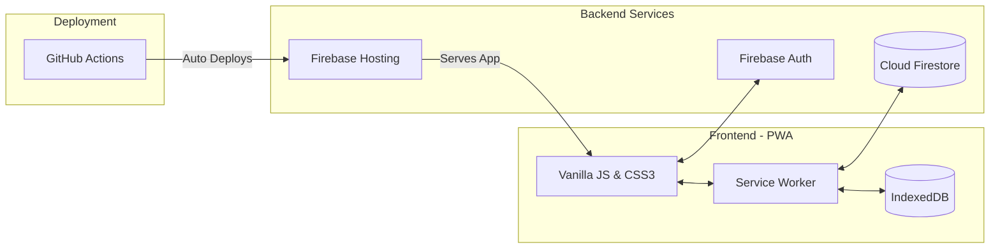

# 📓 NoteBook — Premium PWA & Private Productivity Suite

NoteBook is a high-end, mobile-first Progressive Web App (PWA) designed for secure, offline-first note-taking. It combines modern glassmorphism aesthetics with powerful productivity features.

🔗 **Live App**: [notesbook-3d7fc.web.app](https://notesbook-3d7fc.web.app/)


## ✨ Features

### 🚀 Core Productivity
- **Command Palette (Ctrl+K)**: Quick actions and global search across all notes.
- **Markdown Support**: Rich text formatting with real-time preview.
- **Voice-to-Text**: Dictate notes on the go using native speech recognition.
- **Smart Folders**: Organize your thoughts into nested structures.
- **Categories & Pinning**: High-priority notes stay at the top.

### 🔒 Security & Privacy
- **Secure Authentication**: Email/Password login, Sign-up, and Forgot Password flow.
- **Data Isolation**: Production-grade Firestore Security Rules ensure users can only access their own data.
- **Private Profiles**: Automatic user profile management in Firestore.

### 📱 PWA & Performance
- **Offline-First**: Service worker support for capturing ideas without an internet connection.
- **Installable**: Full mobile app experience on iOS and Android.
- **Responsive Design**: Optimized for everything from mobile phones to desktop monitors.

### 🛠️ Advanced Tools
- **PDF Export**: Generate clean PDF versions of your notes for sharing.
- **Reminders**: Browser-based notifications for time-sensitive notes.
- **Premium UI**: Dark mode, glassmorphism effects, and smooth micro-animations.

---

## 📊 Application Workflows

### 1. User Journey
*How users interact with the core features of NoteBook.*


### 2. Offline-First Synchronization
*How the Service Worker handles offline data creation and background syncing.*


---

## 🏗️ System Architecture

### 3. Component Architecture
*High-level overview of the technology stack and deployment pipeline.*


### Tech Stack
- **Frontend**: Vanilla JavaScript (ES Modules), HTML5, CSS3 (Custom Variables).
- **Backend-as-a-Service**: Firebase 10.x.
- **Database**: Google Cloud Firestore (NoSQL).
- **Hosting**: Firebase Hosting with Global CDN.
- **CI/CD**: GitHub Actions for automated deployment.

### Data Security
The application implements a strict **Deny-by-Default** security policy. Security rules are verified to prevent unauthorized cross-user data access:
```firestore
match /users/{userId} {
  allow read, write: if request.auth != null && request.auth.uid == userId;
}
```

---

## 🚀 Getting Started

### Prerequisites
- Node.js installed.
- [Firebase CLI](https://firebase.google.com/docs/cli) installed (`npm install -g firebase-tools`).

### Local Development
1. Clone the repository.
2. Initialize Firebase: `firebase init`
3. Start the local emulator:
   ```bash
   firebase emulators:start --only hosting
   ```
4. Open `http://localhost:5000` in your browser.

### Deployment
Updates are automatically deployed via GitHub Actions on every push to the `main` branch. 
To deploy manually:
```bash
firebase deploy
```

---

## 🗺️ Roadmap (Upcoming)
- [ ] **AWS Migration**: Moving to S3/CloudFront and Lambda/DynamoDB for AWS mastery.
- [ ] **IaC Integration**: Managing infrastructure with Terraform.
- [ ] **Advanced Monitoring**: AWS CloudWatch and X-Ray implementation.
- [ ] **Multi-factor Authentication (MFA)**.

---

## 📄 License
Custom Project — All rights reserved.
